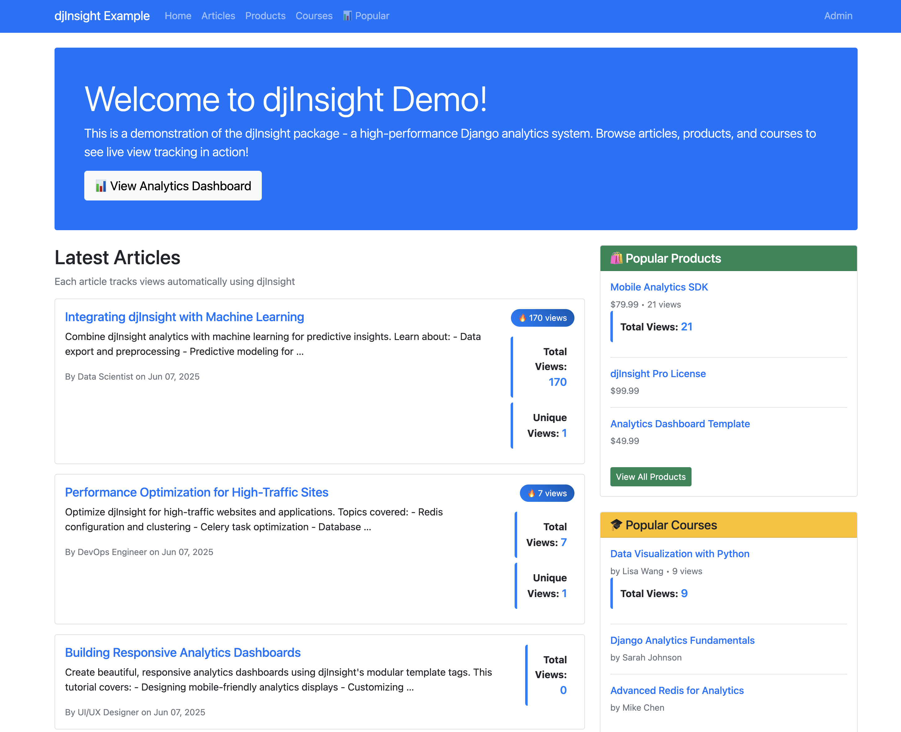
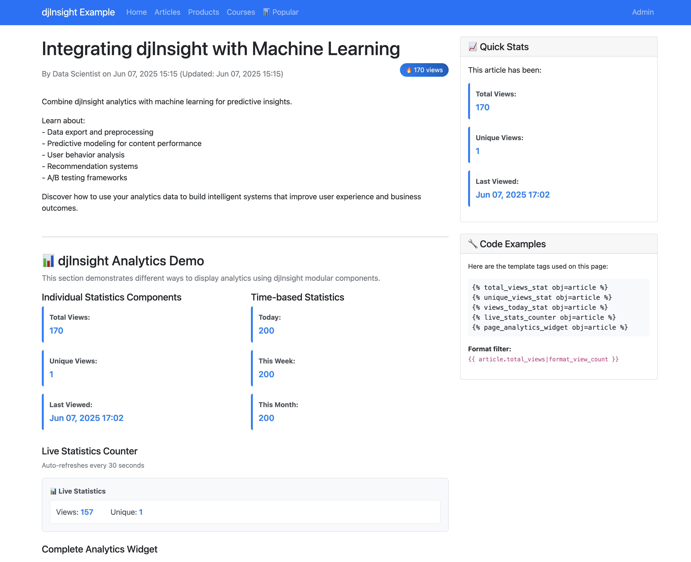
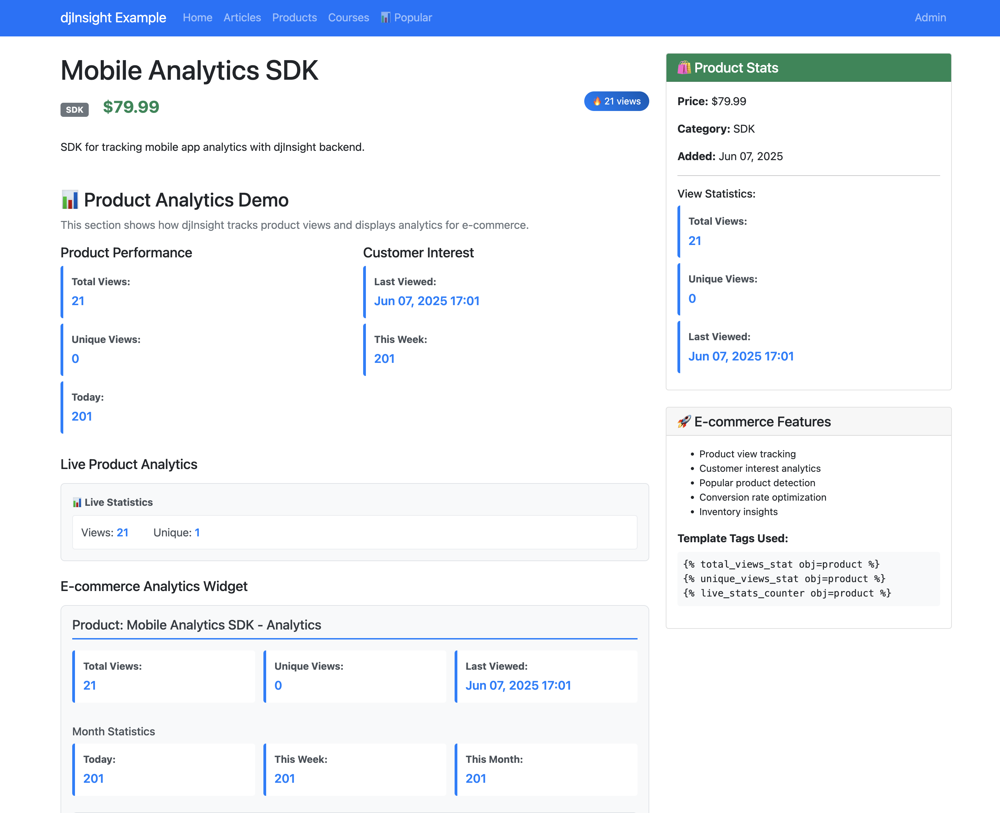
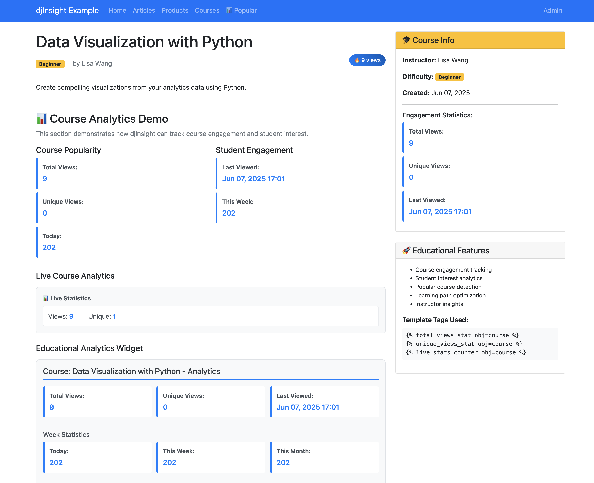
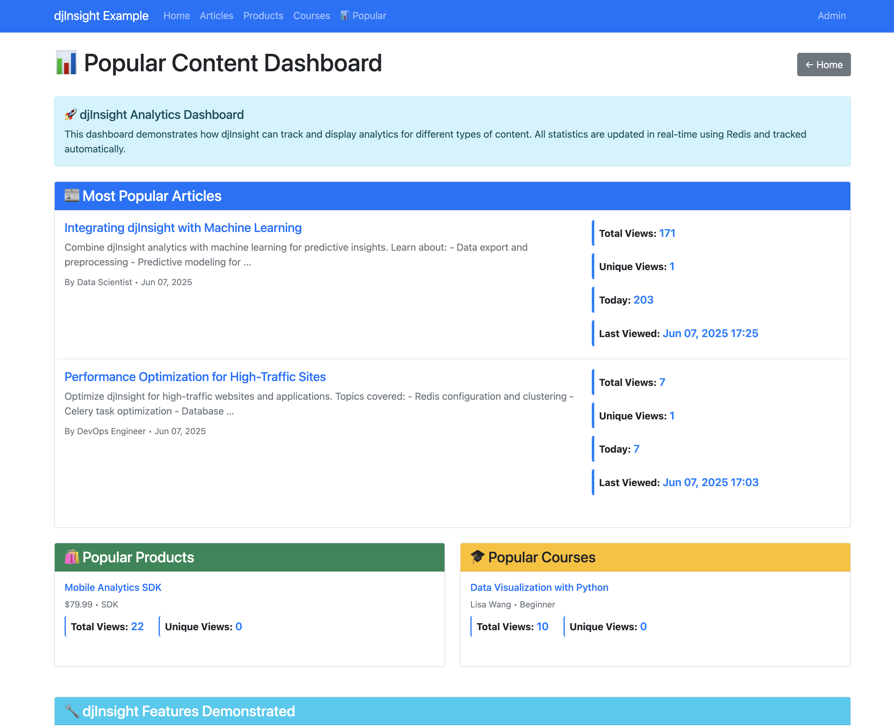

# 📊 djInsight

A high-performance Django/Wagtail package for real-time page view analytics with Redis and Celery.

## 🚀 Live Demo Screenshots

See djInsight in action with our comprehensive example application:

### 📱 Articles List

* Main articles list with counters *

### 📰 Article Analytics 

*Individual article page with live view counters and modular statistics components*

### 📊 Detailed Analytics Demo

*Demonstration of djInsight's modular template tags and live statistics counter*

### 🛒 E-commerce Integration

*Product pages with analytics tracking showing cross-content type support*

### 📈 Popular Content Overview

*Dashboard showing most popular articles, products, and courses with real-time view counts*

---

## 🔧 How It Works

djInsight implements a **two-tier architecture** for maximum performance and reliability:

### 🚀 Tier 1: Real-time Data Collection (Redis)
- **Instant Tracking**: When a user visits a page, JavaScript sends an async request to djInsight's API
- **Redis Storage**: View data is immediately stored in Redis with sub-millisecond write times
- **Session Management**: Unique visitors are tracked using Django's session framework
- **Smart Key Structure**: Uses content-type specific Redis keys (`djinsight:counter:blog.article:123`)
- **No Database Blocking**: Zero impact on page load times - all writes go to Redis first

### 🔄 Tier 2: Background Processing (Celery)
- **Batch Processing**: Celery tasks periodically move data from Redis to PostgreSQL/MySQL
- **Data Aggregation**: Daily summaries are generated for efficient historical queries  
- **Automatic Cleanup**: Old detailed logs are cleaned up while preserving summaries
- **Fault Tolerance**: If database is down, data accumulates safely in Redis

### 🛡️ Reliability Features
- **Backward Compatibility**: Supports both new and legacy Redis key formats
- **Graceful Degradation**: Works even if Celery workers are temporarily down
- **Error Recovery**: Failed batch processing can be retried without data loss
- **Conflict Resolution**: Content-type separation prevents ID conflicts between models

## ✨ Features

- **🌐 Universal Model Support**: Works with any Django model via mixin inheritance
- **🧩 Modular Template Tags**: Individual components for flexible UI design
- **⚡ Real-time Tracking**: JavaScript-based view counting with async Redis storage
- **🚄 High Performance**: Redis pipeline for fast data writes, Celery for background processing
- **👥 Session-based Unique Visitors**: Accurate unique view counting using Django sessions
- **🏷️ Template Tags**: Easy integration with simple template tags
- **📈 Live Statistics**: Real-time stats display with auto-refresh
- **🔄 Automatic Data Processing**: Background tasks for Redis → Database sync
- **🧹 Data Cleanup**: Automatic cleanup of old tracking data
- **🔧 Admin Interface**: Django admin integration for viewing statistics

## 📋 Metrics & Functions

### 📊 Core Metrics Collected
- **📈 Total Views**: Complete view count across all time
- **👥 Unique Views**: Session-based unique visitor tracking
- **📅 Time-based Views**: Today, this week, this month counters
- **⏰ Timestamps**: First view and last view tracking
- **🔗 URL Tracking**: Full request path and referrer information
- **📱 User Agent**: Browser and device information
- **🌍 IP Address**: Geographic tracking (privacy-compliant)

### 🛠️ Key Functions
- **⚡ Live Counters**: Real-time updating statistics with configurable refresh rates
- **📊 Historical Analysis**: Daily/weekly/monthly trend analysis
- **🔍 Content Performance**: Compare performance across different content types
- **📈 Popular Content**: Identify trending and top-performing pages
- **👥 Visitor Patterns**: Unique vs returning visitor analysis
- **🕐 Time Series Data**: View patterns over time with granular control
- **🔄 Data Export**: Export analytics data for external analysis
- **📱 API Access**: REST API for custom integrations and dashboards

### 🏷️ Template Components
- **📊 `total_views_stat`**: Display total view counts
- **👥 `unique_views_stat`**: Show unique visitor numbers  
- **⏰ `last_viewed_stat`**: Last visit timestamp
- **🎯 `first_viewed_stat`**: First view tracking
- **📅 `views_today_stat`**: Today's view count
- **📆 `views_week_stat`**: Weekly view statistics
- **📊 `views_month_stat`**: Monthly performance
- **🔄 `live_stats_counter`**: Auto-refreshing live counter

## 🆚 djInsight vs Google Analytics

### 🏆 **djInsight Advantages**

| Feature | 📊 djInsight | 📈 Google Analytics |
|---------|-------------|-------------------|
| **🚀 Performance** | Sub-millisecond Redis writes | ~100-500ms external requests |
| **🔒 Privacy** | Your servers, full control | Google's servers, limited control |
| **📱 Real-time** | Instant live counters | 24-48h delay for reports |
| **🎨 Customization** | Full template control | Limited widget customization |
| **💾 Data Ownership** | Your database, permanent | Google's data, subject to changes |
| **🛡️ GDPR Compliance** | Built-in privacy controls | Requires complex cookie consent |
| **📊 Granular Control** | Per-model, per-object tracking | Page-level only |
| **🔧 Integration** | Native Django/Wagtail | JavaScript embed only |
| **💰 Cost** | Open source, free | Free tier limitations |

### 📈 **Google Analytics Advantages**

| Feature | 📈 Google Analytics | 📊 djInsight |
|---------|-------------------|-------------|
| **🌍 External Traffic Analysis** | Full referrer tracking | Basic referrer only |
| **🎯 Advanced Segmentation** | Extensive user segments | Session-based only |
| **📊 E-commerce Tracking** | Built-in funnel analysis | Manual implementation |
| **🔍 Search Console Integration** | SEO data integration | No SEO features |
| **📱 Mobile App Tracking** | Native mobile support | Web-only focus |
| **🤖 Machine Learning** | AI-powered insights | Manual analysis |

### 🤝 **Best Practice: Use Both**

Many sites use **djInsight + Google Analytics** together:

- **📊 djInsight**: Internal dashboards, real-time stats, GDPR-compliant tracking
- **📈 Google Analytics**: Marketing analysis, SEO insights, external traffic sources
- **🔄 Hybrid Approach**: djInsight for app performance, GA for marketing metrics

## 📦 Installation

```bash
pip install djInsight
```

## Quick Start

### 1. Add to Django Settings

```python
# settings.py
INSTALLED_APPS = [
    'django.contrib.admin',
    'django.contrib.auth',
    'django.contrib.contenttypes',
    'django.contrib.sessions',
    'django.contrib.messages',
    'django.contrib.staticfiles',
    
    # Required dependencies
    'django_celery_beat',  # For periodic tasks
    
    # Your apps
    'djInsight',  # Add djInsight
    'myapp',  # Your app with models to track
]

# Redis Configuration (required)
CACHES = {
    'default': {
        'BACKEND': 'django_redis.cache.RedisCache',
        'LOCATION': 'redis://127.0.0.1:6379/1',
        'OPTIONS': {
            'CLIENT_CLASS': 'django_redis.client.DefaultClient',
        }
    }
}

# Celery Configuration (required for background processing)
CELERY_BROKER_URL = 'redis://localhost:6379/0'
CELERY_RESULT_BACKEND = 'redis://localhost:6379/0'
CELERY_ACCEPT_CONTENT = ['json']
CELERY_TASK_SERIALIZER = 'json'
CELERY_RESULT_SERIALIZER = 'json'
CELERY_TIMEZONE = 'UTC'

# djInsight Settings (optional)
DJINSIGHT_ENABLE_TRACKING = True  # Default: True
DJINSIGHT_REDIS_KEY_PREFIX = 'djinsight:'  # Default: 'djinsight:'
DJINSIGHT_CLEANUP_DAYS = 90  # Default: 90 (days to keep detailed logs)
```

### 2. Add to URLs

```python
# urls.py
from django.contrib import admin
from django.urls import path, include

urlpatterns = [
    path('admin/', admin.site.urls),
    path('djInsight/', include('djInsight.urls')),
    # ... your other URLs
]
```

### 3. Use with Your Models

djInsight works with **any Django model** through the `PageViewStatisticsMixin`:

#### Wagtail Pages

```python
# models.py
from wagtail.models import Page
from djInsight.models import PageViewStatisticsMixin

class BlogPage(Page, PageViewStatisticsMixin):
    introduction = models.TextField(blank=True)
    body = RichTextField(blank=True)
    
    content_panels = Page.content_panels + [
        FieldPanel('introduction'),
        FieldPanel('body'),
    ]
```

#### Regular Django Models

```python
# models.py
from django.db import models
from django.urls import reverse
from djInsight.models import PageViewStatisticsMixin

class Article(models.Model, PageViewStatisticsMixin):
    title = models.CharField(max_length=200)
    slug = models.SlugField(unique=True)
    content = models.TextField()
    published_at = models.DateTimeField(auto_now_add=True)
    
    def get_absolute_url(self):
        return reverse('article_detail', kwargs={'slug': self.slug})
    
    def __str__(self):
        return self.title

class Product(models.Model, PageViewStatisticsMixin):
    name = models.CharField(max_length=100)
    slug = models.SlugField(unique=True)
    price = models.DecimalField(max_digits=10, decimal_places=2)
    description = models.TextField()
    
    def get_absolute_url(self):
        return reverse('product_detail', kwargs={'slug': self.slug})
    
    def __str__(self):
        return self.name

class Course(models.Model, PageViewStatisticsMixin):
    title = models.CharField(max_length=200)
    slug = models.SlugField(unique=True)
    instructor = models.CharField(max_length=100)
    difficulty = models.CharField(max_length=50)
    
    def get_absolute_url(self):
        return reverse('course_detail', kwargs={'slug': self.slug})
    
    def get_display_name(self):
        return f"Course: {self.title} by {self.instructor}"

class Document(models.Model, PageViewStatisticsMixin):
    title = models.CharField(max_length=200)
    file = models.FileField(upload_to='documents/')
    category = models.CharField(max_length=100)
    
    def get_absolute_url(self):
        return reverse('document_view', kwargs={'pk': self.pk})
    
    def get_display_name(self):
        return f"Document: {self.title}"

# For models without get_absolute_url, override get_tracking_url:
class CustomModel(models.Model, PageViewStatisticsMixin):
    name = models.CharField(max_length=100)
    
    def get_tracking_url(self):
        return f'/custom/{self.id}/'
    
    def get_display_name(self):
        return f"Custom: {self.name}"

# E-commerce example
class Category(models.Model, PageViewStatisticsMixin):
    name = models.CharField(max_length=100)
    slug = models.SlugField(unique=True)
    
    def get_absolute_url(self):
        return reverse('category_detail', kwargs={'slug': self.slug})

# Real estate example  
class Property(models.Model, PageViewStatisticsMixin):
    address = models.CharField(max_length=200)
    price = models.DecimalField(max_digits=12, decimal_places=2)
    bedrooms = models.IntegerField()
    
    def get_absolute_url(self):
        return reverse('property_detail', kwargs={'pk': self.pk})
    
    def get_display_name(self):
        return f"Property: {self.address}"
```

### 4. Template Tags Usage

djInsight now provides **modular template tags** for maximum flexibility:

#### Basic Tracking

```html


<!-- Automatic object detection from context -->


<!-- Or specify the object explicitly -->


```

#### Individual Statistics Components

```html


<!-- Individual statistics - mix and match as needed -->





<!-- Time-based statistics -->




<!-- Live counter with auto-refresh -->

```

#### Complete Analytics Widget

```html


<!-- All-in-one analytics widget -->

```

#### Format Numbers

```html


<!-- Format large numbers (1234 -> 1.2K) -->
{{ article.total_views|format_view_count }}
{{ product.unique_views|format_view_count }}
```

### 5. Template Examples

#### Article Detail with Modular Stats

```html
<!-- templates/articles/article_detail.html -->




    <article>
        <h1>{{ article.title }}</h1>
        <div class="article-meta">
            <span>Published: {{ article.published_at|date:"M d, Y" }}</span>
            <span></span>
        </div>
        
        <div class="content">
            {{ article.content|linebreaks }}
        </div>
        
        <!-- Custom stats layout -->
        <div class="article-stats">
            <div class="main-stats">
                
                
            </div>
            
            <div class="time-stats">
                
                
                
            </div>
            
            <div class="meta-stats">
                
                
            </div>
        </div>
        
        <!-- Live counter -->
        
    </article>
    
    <!-- Track this page view -->
    

```

#### Product Page with Conditional Stats

```html
<!-- templates/shop/product_detail.html -->




    <div class="product">
        <h1>{{ product.name }}</h1>
        <p class="price">${{ product.price }}</p>
        
        <!-- Show popularity if product has views -->
        
        <div class="popularity-badge">
            🔥 Popular: {{ product.total_views|format_view_count }} views
        </div>
        
        
        <div class="description">
            {{ product.description|linebreaks }}
        </div>
        
        <!-- Minimal stats display -->
        <div class="product-stats">
            
            
            
        </div>
        
        <!-- Live tracking for high-value products -->
        
            
        
    </div>
    
    

```

#### Dashboard with Multiple Objects

```html
<!-- templates/dashboard.html -->




    <div class="dashboard">
        <h1>Content Dashboard</h1>
        
        
        <div class="content-card">
            <h3><a href="{{ article.get_absolute_url }}">{{ article.title }}</a></h3>
            
            <div class="stats-row">
                
                
                
            </div>
            
            
                <span class="badge trending">🔥 Trending</span>
            
        </div>
        
        
        <!-- Admin-only detailed analytics -->
        
        <div class="admin-section">
            <h2>📊 Admin Analytics</h2>
            
                <div class="admin-stats">
                    <strong>{{ item.title }}</strong>
                    <div class="detailed-stats">
                        
                        
                        
                        
                        
                    </div>
                </div>
            
        </div>
        
    </div>

```

#### Mobile-Optimized Stats

```html
<!-- templates/mobile/article_detail.html -->




    <article class="mobile-article">
        <h1>{{ article.title }}</h1>
        
        <!-- Compact stats for mobile -->
        <div class="mobile-stats">
            <span class="stat-item">
                {{ article.total_views|format_view_count }} views
            </span>
            <span class="stat-item">
                {{ article.unique_views|format_view_count }} readers
            </span>
        </div>
        
        <div class="content">
            {{ article.content|linebreaks }}
        </div>
        
        <!-- Optional: Show more stats on tap -->
        <details class="expandable-stats">
            <summary>📊 More Statistics</summary>
            <div class="expanded-stats">
                
                
                
                
            </div>
        </details>
        
        <!-- Live counter for mobile -->
        
    </article>
    
    

```

### 6. Available Template Tags

#### Core Tags

- `` - JavaScript tracking code
- `` - Live statistics with auto-refresh
- `` - Complete analytics widget
- `{{ count|format_view_count }}` - Number formatting filter

#### Individual Statistics Components

- `` - Total page views
- `` - Unique visitors count
- `` - Last view timestamp
- `` - First view timestamp
- `` - Today's views
- `` - This week's views
- `` - This month's views
- `` - Live counter with auto-refresh

#### All tags support:
- **Automatic object detection** from template context
- **Explicit object parameter**: `obj=article`
- **Flexible styling** through CSS classes

### 7. Styling Your Statistics

Each component includes CSS classes for easy customization:

```css
/* Individual stat items */
.djinsight-stat-item {
    background: white;
    padding: 0.75rem;
    border-radius: 4px;
    border-left: 4px solid #007bff;
    margin-bottom: 0.5rem;
}

.djinsight-stat-value {
    color: #007bff;
    font-size: 1.1rem;
    font-weight: 600;
}

/* Live counter */
.djinsight-live-counter {
    background: #f8f9fa;
    border: 1px solid #dee2e6;
    border-radius: 6px;
    padding: 1rem;
    margin: 1rem 0;
}

/* Complete analytics widget */
.djinsight-analytics-widget {
    background: #f8f9fa;
    border: 1px solid #dee2e6;
    border-radius: 8px;
    padding: 1rem;
    margin: 1rem 0;
}
```

### 8. Run Migrations

```bash
python manage.py migrate djInsight
```

### 9. Start Background Services

Start Redis:
```bash
redis-server
```

Start Celery worker:
```bash
celery -A your_project worker -l info
```

Start Celery Beat (for periodic tasks):
```bash
celery -A your_project beat -l info
```

## Advanced Usage

### Custom Layouts

Create your own layouts by combining individual components:

```html


<!-- Horizontal stats bar -->
<div class="stats-bar">
    
    
    
</div>

<!-- Vertical stats sidebar -->
<aside class="stats-sidebar">
    <h4>📊 Statistics</h4>
    
    
    
    
</aside>

<!-- Grid layout -->
<div class="stats-grid">
    
    
    
    
</div>
```

### Conditional Display

```html


<!-- Show different stats based on content type -->

    <div class="popular-content">
        
        
        
    </div>

    <div class="new-content">
        <p>📝 New article - be the first to read!</p>
        
    </div>


<!-- Admin-only detailed stats -->

    <div class="admin-analytics">
        
    </div>

```

### 📊 Analytics Queries

```python
# Find most popular content
from django.db.models import Q, F
from myapp.models import Article, Product

# Most viewed articles this month
popular_articles = Article.objects.filter(
    last_viewed_at__month=timezone.now().month
).order_by('-total_views')[:10]

# Products with high unique view ratio
interesting_products = Product.objects.annotate(
    unique_ratio=F('unique_views') * 100.0 / F('total_views')
).filter(
    total_views__gte=100,
    unique_ratio__gte=70.0
).order_by('-unique_ratio')
```

### 🏷️ Template Tag Options

#### 📍 page_view_tracker
```html

```
- `obj`: Object to track (auto-detected if not provided)
- `async_load`: Load after page load (default: True)
- `debug`: Enable JavaScript console logging (default: False)

#### 📈 live_stats_counter
```html

```
- `obj`: Object to show stats for (auto-detected if not provided)
- `show_unique`: Show unique view count (default: True)
- `refresh_interval`: Auto-refresh in seconds (default: 30)

#### 📊 page_analytics_widget
```html

```
- `obj`: Object to show analytics for (auto-detected if not provided)
- `period`: Time period for statistics ('week' or 'month')

### 🔧 Management Commands

```bash
# Process Redis data to database manually
python manage.py process_pageviews --batch-size 100

# Generate daily summaries
python manage.py generate_summaries

# Cleanup old data
python manage.py cleanup_pageviews --days 30 --yes
```

### 🎯 Custom Context Detection

The system automatically looks for objects in template context using these variable names:
- 📄 `page` (Wagtail pages)
- 🔧 `object` (Django generic views)
- 📝 `article` (custom articles)
- 📰 `post` (blog posts)
- 📦 `item` (general items)

### 🔄 Backward Compatibility

For existing Wagtail users, these aliases are provided:

```html
<!-- Old Wagtail-specific tags still work -->



```

## ⚡ Performance

- **🚀 Redis Pipeline**: Batches multiple Redis operations for better performance
- **💾 Template Caching**: Individual components can be cached separately
- **🔄 Async JavaScript**: Non-blocking page view tracking
- **🏗️ Celery Tasks**: Background processing prevents database bottlenecks
- **📊 Data Aggregation**: Daily summaries reduce query complexity
- **🧹 Automatic Cleanup**: Keeps database size manageable

## 🔑 Redis Key Structure

djInsight uses Redis for high-performance real-time analytics with the following key structure:

### 📋 View Data Keys
Individual page view records with complete metadata:
```
djinsight:12345678-abcd-1234-5678-abcdef123456
```
Each key contains JSON data with page_id, content_type, session, IP, timestamp, etc.

### 📊 Counter Keys
For tracking total views with content type identification:
```
djinsight:counter:blog.article:5        # Content-type specific format
```

### 👥 Unique Counter Keys
For tracking unique visitors per content:
```
djinsight:unique_counter:blog.article:5  # Content-type specific format
```

### 🔐 Session Tracking Keys
To prevent double-counting views from the same session:
```
djinsight:session:abc123:page:5
```

### 🔍 Analysis Commands

Use the included management command to analyze your Redis keys:

```bash
# Analyze Redis key structure and identify object types
python manage.py analyze_redis

# Sample output:
# Redis Key Analysis:
# Object ID 5: blog.article - "Article Title" (15 total views)
# Object ID 12: shop.product - "Product Name" (8 total views)
```

### 🔄 Key Migration

The system automatically creates content-type-specific keys for better object identification:

- **✅ New implementations**: Use content-type keys for better object identification
- **🔍 Analytics queries**: Can distinguish between different model types
- **📊 Enhanced tracking**: Better separation of different content types

### ⏰ Key Expiration

All Redis keys have configurable expiration times:

```python
# settings.py
DJINSIGHT_REDIS_EXPIRATION = 60 * 60 * 24 * 7  # 7 days (default)
```

## ⚙️ Configuration Options

```python
# settings.py

# Enable/disable tracking
DJINSIGHT_ENABLE_TRACKING = True

# Redis key prefix
DJINSIGHT_REDIS_KEY_PREFIX = 'djinsight:'

# How long to keep detailed view logs (days)
DJINSIGHT_CLEANUP_DAYS = 90

# Batch size for processing Redis data
DJINSIGHT_BATCH_SIZE = 1000

# Redis connection timeout
DJINSIGHT_REDIS_TIMEOUT = 5
```

## 📋 Requirements

- 🐍 Python 3.8+
- 🎯 Django 3.2+
- 🚀 Redis 4.0+
- 🔄 Celery 5.0+
- 📦 django-redis
- 🌐 Optional: Wagtail 3.0+ (for Wagtail integration)

## 📄 License

MIT License